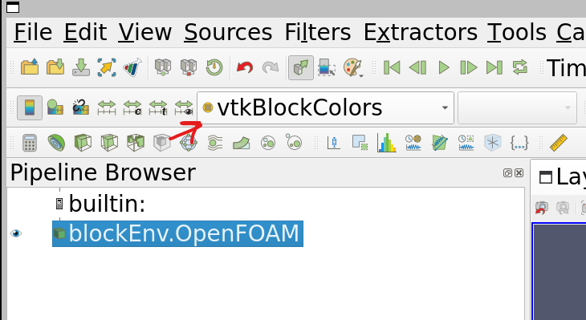
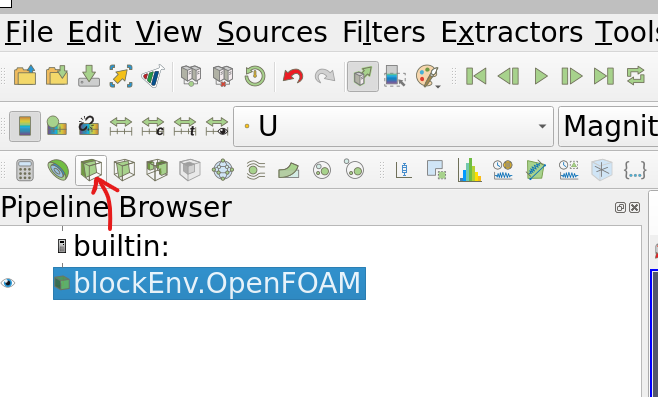
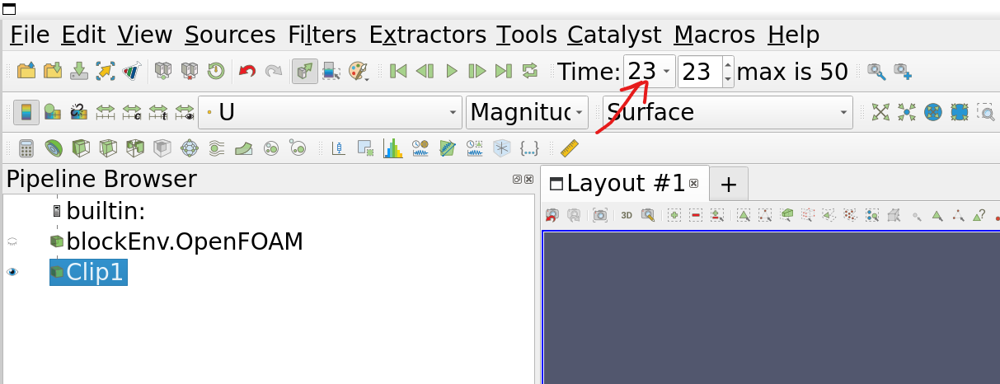
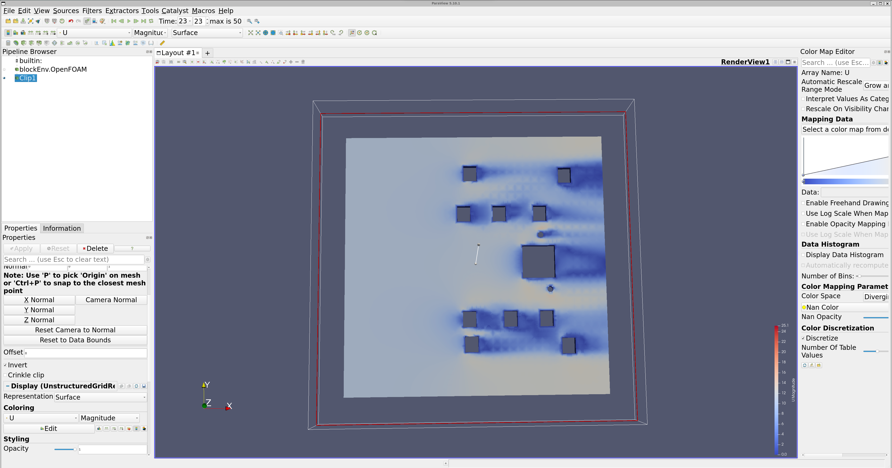
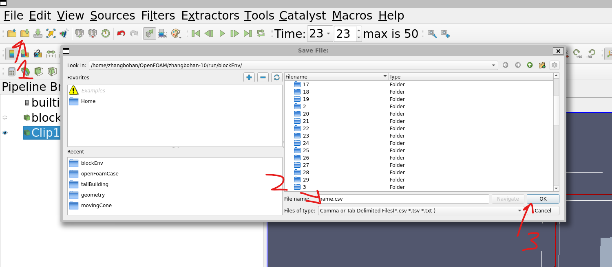
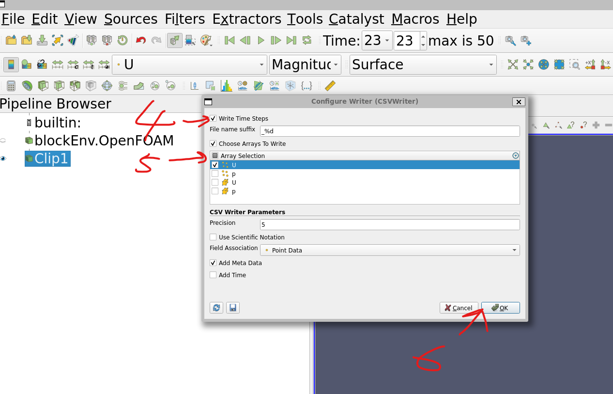

# RealisticWind

This project uses OpenFoam to simulate realist wind conditions for a given geometry. 

## Requirements
- Linux or Windows Linux Subsystem (WSL) 
- OpenFoam 10
- ParaView (optional, for visualization)

## Hardware suggestion
- 6+ cores CPU
- 8GB+ RAM
- 20GB+ available storage


## Getting Started
### install openfoam on windows linux subsystem
install linux subsystem
```commandline
wsl --install
```
Distributor ID: Ubuntu
Description:    Ubuntu 22.04.1 LTS
Release:        22.04
Codename:       jammy

After installing WSL, open the terminal and
run setup.sh
```bash
sudo bash setup.sh
```

Verify the installation by running the following command
```bash
foamVersion
```
Should return
```text
OpenFOAM 10
```

If that didn't work, follow the following steps to install OpenFoam 10 on WSL manually
```bash
sudo sh -c "wget -O - [http://dl.openfoam.org/gpg.key](http://dl.openfoam.org/gpg.key) | apt-key add -"

sudo add-apt-repository [http://dl.openfoam.org/ubuntu](http://dl.openfoam.org/ubuntu)

sudo apt-get update

sudo apt-get install openfoam10

sudo apt-get install --only-upgrade openfoam10
```

next add the following line to the end of file `.bashrc`
```text
source /opt/openfoam10/etc/bashrc
```

source the new bashrc file
```bash
source ~/.bashrc
```

### Python virtual environment
```bash
cd python
python3 -m venv venv
source venv/bin/activate
pip install -r requirements.txt
```


### install openfoam on windows
NOT SUPPORTED

## Directory Structure
all OpenFOAM research scenarios are in the run directory
```bash
cd run
```

detailed description of each example is in the readme.md file in each directory

In general, run the following command to run the simulation
```bash
cd run
cd {example directory}
bash ./Allrun
```

## How to use ParaView

### Visualizing the results
To visualize the results of the simulation, you can use ParaView.
```bash
cd run
cd {example directory}
# Assuming you have already run the simulation
paraFoam
```

since all `Allrun` scripts creates a empty `results.foam` file, when you run `paraFoam` under a case directory, it will open the case in ParaView. 
But the results will not be visible, you need to change the `results.foam` to display the U, p, and other fields.

]

click on this bar and select the fields you want to display. U in this case.

now it will display the velocity field from top-down view, to see the inside of the geometry, you can use the clip filter.



to view the result at a different time, you can use the time slider at the top of the window.



The resulting visualization looks like this


### Saving the results
You can save each wind velocity field as a .csv file by using paraView, or use openFoam's built-in command `postProcess -func writeCellCentres` to postprocess the results by export each cell's wind velocity to a text file. the index will bijectionally map to the `point` file in each time step folder.

Or, alternatively, you can use the paraView:





This will save all the wind velocity field at each time step as a .csv file in the `postProcessing` folder in the case directory.


## Known Issues

### Parallel computing issue
If your CPU has less than 6 cores, you need to change the `runParallel` to `runApplication` in the `Allrun` file in each example directory, otherwise the simulation may not run. 

Or change your available cores in the `decomposeParDict` file in the `system` folder in each example directory by changing `numberOfSubdomains  6` to your available cores.

### Storage issue
https://github.com/microsoft/WSL/issues/4699

If you are using WSL, the storage is limited to the 100GB, and once allocated, it cannot be freed.
to free up the storage after simulating large cases, we need to delete the old cases to free up the storage for windows.

First locate the WSL image in the windows file system
it should be in the following directory

`C:\Users\{username}\AppData\Local\Packages\CanonicalGroupLimited.Ubunto{hash}\LocalState\ext4.vhdx`

Then free up the storage by optimizing the image
```PowerShell
wsl --shutdown
optimize-vhd -Path {path to ext4.vhdx} -Mode full
```

### ParaView cannot be opened
if you cannot open paraView using the command `paraFoam`
sometime it because unusual folder name in the case folder.
delete any that is not the default folder name, and try again.


### Allrun and Allclean cannot be executed
if you see
```text
./Allclean: line 3: $'\r': command not found
```
It is because the file is not in the correct format, change the file line separator to `LF` using any text editor.

**IMPORTANT:**
if you already ran the `Allrun` script in `CRLF` format, there will be a `results.foam` file with `LF` at the end of the file name, and it will cause OpenFoam to crash. 
Just remove it and run the `Allrun` script again in `LF` format.